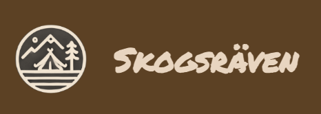

# Skogsräven

Skogsräven is an e-commerce web application with a containerized backend consisting of microservices. Front and backend can be run separately, while the backend is further divided into individual services for products, categories, orders, users and notifications.

## Tech stack

### Frontend

- React
- Typescript
- CSS

### Backend / Data

- Node.js
- Express
- Docker
- RabbitMQ
- Redis
- MongoDB
- K8s
- Bcrypt
- Mongoose

## Quick start (recommended)

run `docker-compose up` to start the whole application in one go.
The application will be available at:

- Frontend: http://localhost:4173
- RabbitMQ Management: http://localhost:15673
- MongoDB: http://localhost:27018

To stop all services, run `docker-compose down`

### Frontend only

1. run `npm install` from the frontend folder to install the dependencies.
2. to start the frontend only, run `npm start`.

### Backend only

1. run `npm install` from each of the service folders (`product-service`, `category-service`, `order-service`, `user-service` and `notification-service`.), as well as the `common` folder within the backend.
2. run `npm start` for each of the services you want to run respectively
3. run `docker run -d --name rabbitmq -p 5673:5672 -p 15673:15672 rabbitmq:3-management` to start RabbitMQ
4. run `docker run -d --name redis -p 6380:6379 redis:latest` to start redis
5. run `docker run -d --name mongodb -p 27018:27017 -v mongodb_data:/data/db mongo:latest` to start MongoDB

### Service Ports

- Frontend: 4173
- User Service: 3001
- Product Service: 3002
- Order Service: 3003
- Notification Service: 3004
- Category Service: 3005
- RabbitMQ: 5673 (AMQP), 15673 (Management UI)
- Redis: 6380
- MongoDB: 27018
